# FLOW PROSES PENGGUNAAN APLIKASI
## Sistem Pengamanan Lebaran Blok F RT 024

---

**Versi:** 1.0
**Tanggal:** Maret 2026

---

## 📋 DAFTAR ISI

1. [Flow Admin Dashboard](#1-flow-admin-dashboard)
2. [Flow Mobile App](#2-flow-mobile-app)
3. [Flow Integrasi Admin-Mobile](#3-flow-integrasi-admin-mobile)

---

## 1. FLOW ADMIN DASHBOARD

### 1.1 Flow Login dan Setup Awal

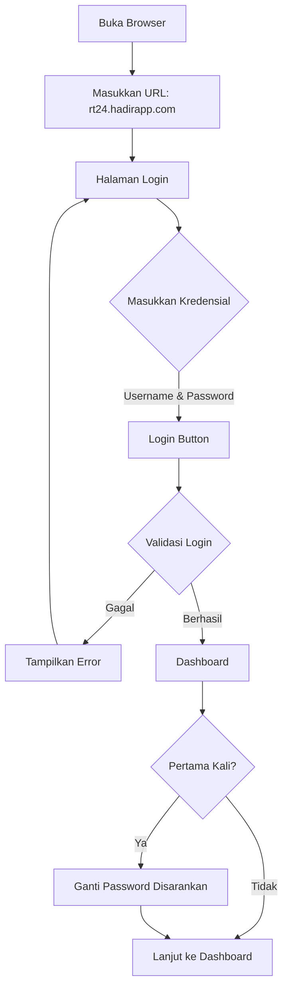

---

### 1.2 Flow Manajemen Petugas Jaga

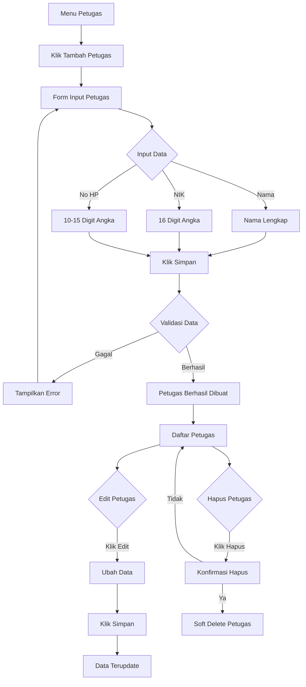

---

### 1.3 Flow Manajemen QR Code

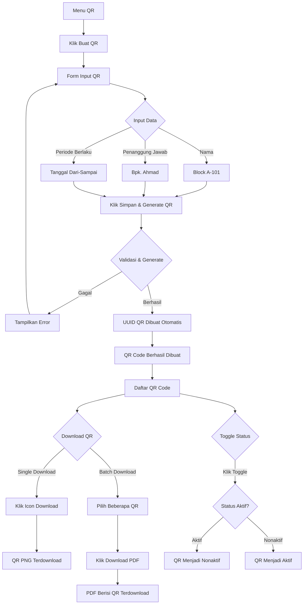

---

### 1.4 Flow Monitoring Scan Logs

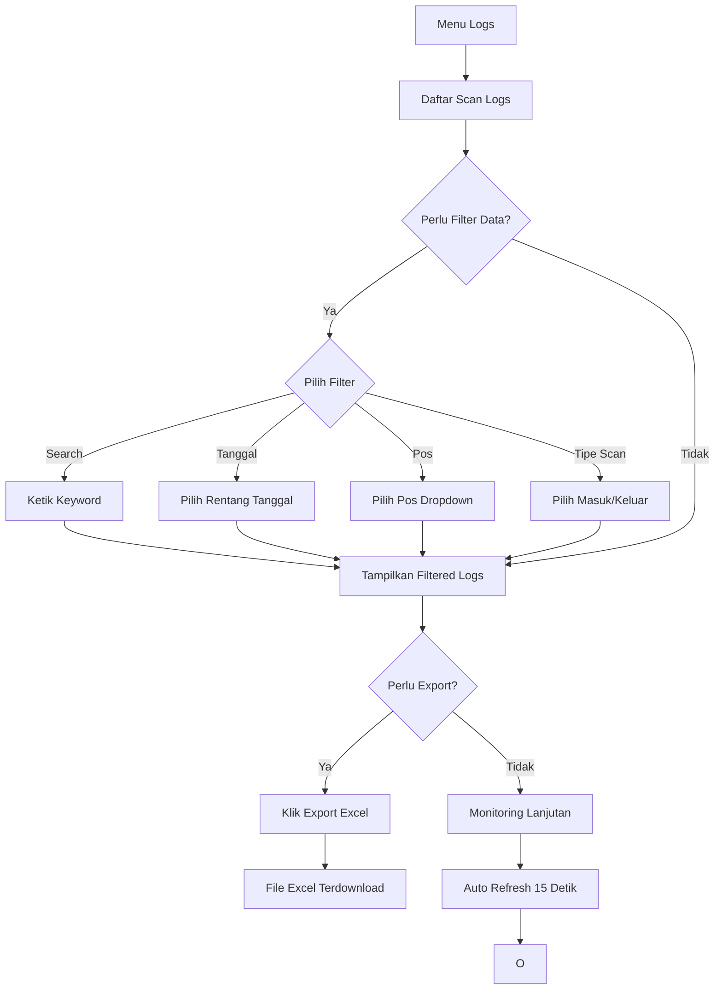

---

## 2. FLOW MOBILE APP

### 2.1 Flow Login dan Setup

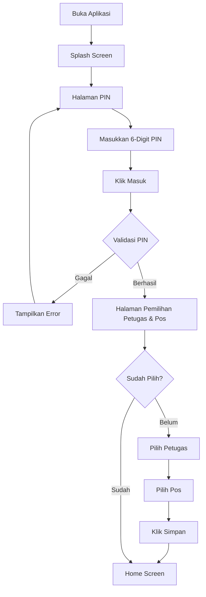

---

### 2.2 Flow Scan QR Code

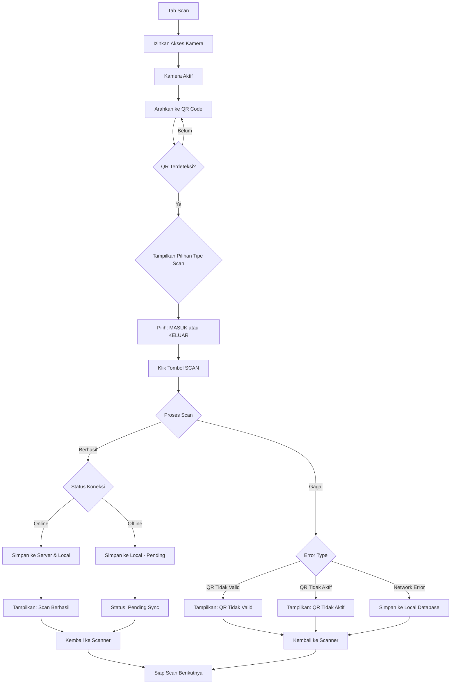

---

### 2.3 Flow Offline Sync

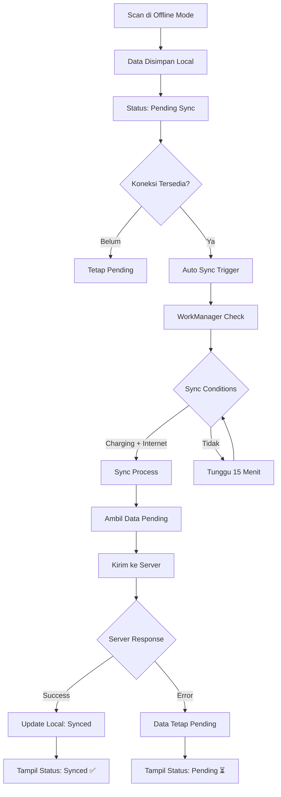

---

### 2.4 Flow Sync Master Data

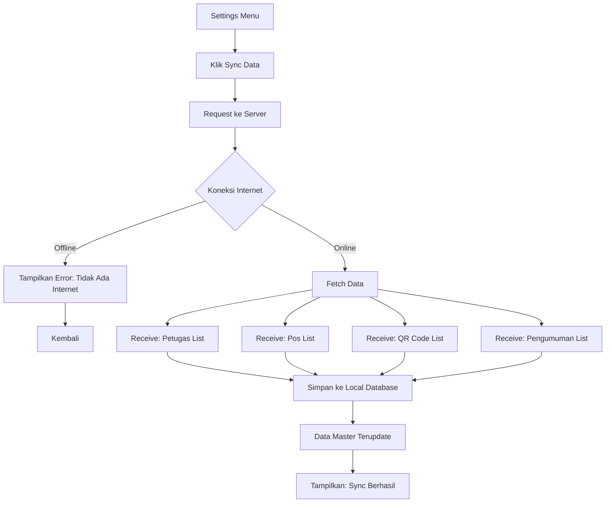

---

## 3. FLOW INTEGRASI ADMIN-MOBILE

### 3.1 Flow End-to-End: Dari Pembuatan QR Sampai Scan

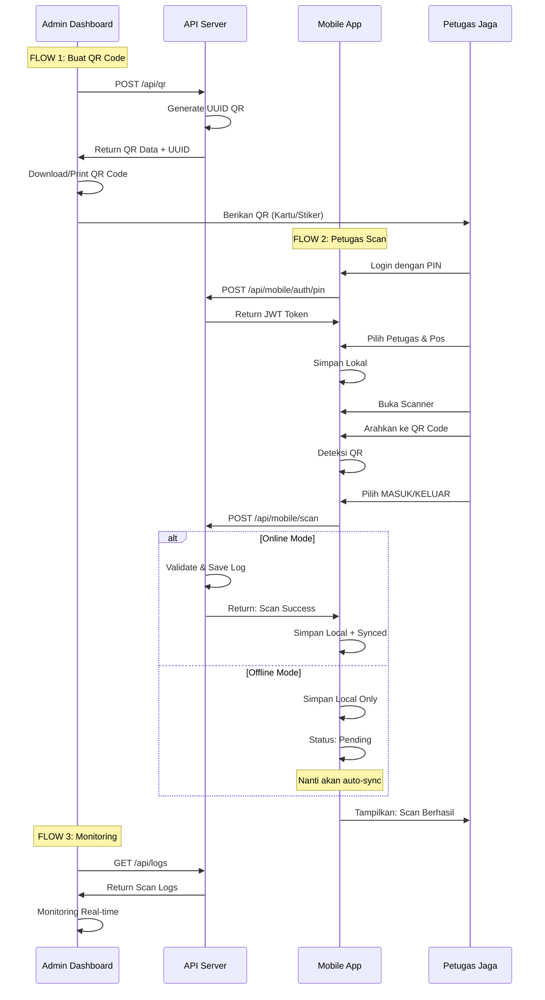

---

### 3.2 Flow Offline → Online Sync

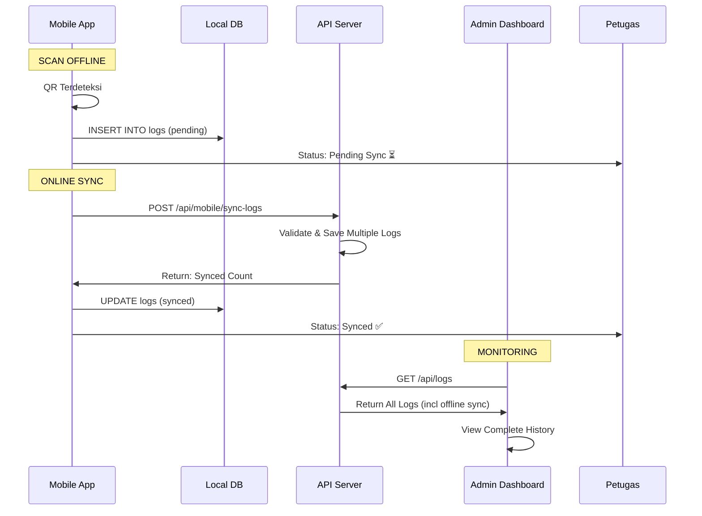

---

### 3.3 Flow Pengumuman System

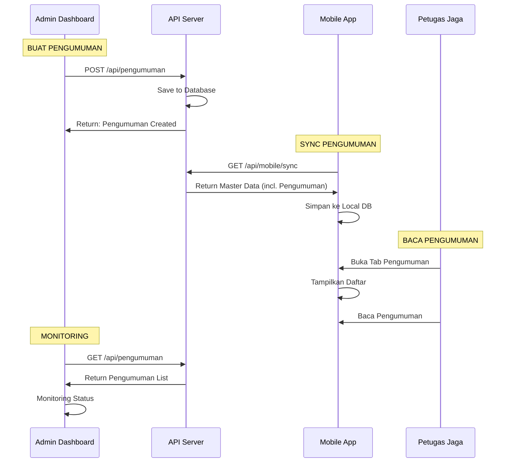

---

## 4. FLOW DIAGRAM ASCII

### 4.1 Flow Login Admin

```
┌─────────┐
│ Buka    │
│ Browser │
└────┬────┘
     │
     ▼
┌─────────────────┐
│ blokf.hadirapp. │
│     com         │
└────┬────────────┘
     │
     ▼
┌─────────────────┐
│  LOGIN SCREEN   │
│ ┌─────────────┐ │
│ │ Username    │ │
│ │ Password    │ │
│ └─────────────┘ │
│ ┌─────────────┐ │
│ │ [LOGIN]     │ │
│ └─────────────┘ │
└────┬────────────┘
     │
     ▼
┌─────────────────┐
│  DASHBOARD      │
│                 │
│ ┌─────────────┐ │
│ │ Statistics  │ │
│ │ Recent Scan │ │
│ └─────────────┘ │
└─────────────────┘
```

---

### 4.2 Flow Buat QR Code

```
┌──────────────────┐
│   MENU QR        │
└────┬─────────────┘
     │
     ▼
┌──────────────────┐
│  KLIK + BUAT QR  │
└────┬─────────────┘
     │
     ▼
┌──────────────────┐
│  FORM INPUT QR   │
│ ┌──────────────┐ │
│ │ Nama         │ │
│ │ Penanggung   │ │
│ │ Jawab        │ │
│ │ Valid Dari   │ │
│ │ Valid Sampai │ │
│ └──────────────┘ │
│ ┌──────────────┐ │
│ │ [SIMPAN &    │ │
│ │  GENERATE QR] │ │
│ └──────────────┘ │
└────┬─────────────┘
     │
     ▼
┌──────────────────┐
│  SYSTEM          │
│ ┌──────────────┐ │
│ │ Generate UUID │ │
│ │ Save to DB    │ │
│ └──────────────┘ │
└────┬─────────────┘
     │
     ▼
┌──────────────────┐
│  SUCCESS         │
│                 │
│ QR Code Created │
│ UUID: xxx-xxx-xx│
│                 │
│ ┌──────────────┐ │
│ │ [DOWNLOAD]    │ │
│ │ [PRINT]       │ │
│ └──────────────┘ │
└──────────────────┘
```

---

### 4.3 Flow Scan Mobile

```
┌──────────────┐
│ TAB SCAN     │
└────┬─────────┘
     │
     ▼
┌──────────────┐
│ KAMERA AKTIF │
│ ┌─────────┐  │
│ │   QR    │  │
│ │  FRAME  │  │
│ └─────────┘  │
└────┬─────────┘
     │
     ▼
┌──────────────┐
│ SCAN SUCCESS │
│              │
│ QR Terbaca   │
│ Block A-101  │
└────┬─────────┘
     │
     ▼
┌──────────────┐
│ PILIH TIPE   │
│ ┌──────────┐ │
│ │ MASUK    │ │
│ │ KELUAR   │ │
│ └──────────┘ │
└────┬─────────┘
     │
     ▼
┌──────────────┐
│ CONFIRM SCAN │
│ ┌──────────┐ │
│ │ [SCAN]   │ │
│ └──────────┘ │
└────┬─────────┘
     │
     ▼
┌──────────────┐
│  PROSES SCAN │
│              │
│ Validate QR  │
│ Save to DB   │
└────┬─────────┘
     │
     ▼
┌──────────────┐
│  SUCCESS ✅  │
│              │
│ Block A-101  │
│ Masuk        │
│ 13:30 WIB    │
└──────────────┘
```

---

### 4.4 Flow Offline Sync

```
┌──────────────┐
│ OFFLINE MODE │
│              │
│ No Internet  │
└────┬─────────┘
     │
     ▼
┌──────────────┐
│  SCAN QR     │
└────┬─────────┘
     │
     ▼
┌──────────────────┐
│  SAVE LOCAL ONLY │
│                  │
│  Status: PENDING │
│  ⏳             │
└────┬─────────────┘
     │
     ▼
┌──────────────┐
│ WAITING      │
│              │
│ Untuk Online │
└────┬─────────┘
     │
     ▼
┌──────────────┐
│ CONNECTION   │
│ RESTORED!    │
│              │
│ WiFi/Data On │
└────┬─────────┘
     │
     ▼
┌──────────────┐
│ AUTO SYNC    │
│              │
│ WorkManager  │
│ Every 15 min │
└────┬─────────┘
     │
     ▼
┌──────────────┐
│  SYNC TO     │
│  SERVER      │
└────┬─────────┘
     │
     ▼
┌──────────────┐
│  SUCCESS ✅  │
│              │
│ Status: SYNC │
│  ✅           │
└──────────────┘
```

---

## 5. DECISION TREE

### 5.1 Decision Tree: Scan Result

```
                    ┌───────────┐
                    │   SCAN    │
                    └─────┬─────┘
                          │
                          ▼
                   ┌────────────────┐
                   │ QR Detected?   │
                   └────┬───────┬───┘
                       │NO       │YES
                       ▼          ▼
                ┌─────────┐  ┌──────────────┐
                │ Continue│  │ Show Options │
                │ Scan   │  └──────┬───────┘
                └─────────┘         │
                                     ▼
                          ┌────────────────────┐
                          │ User Select Type   │
                          └──────┬───────┬────┘
                                 │       │
                              ┌───┘       └───┐
                              │MASUK        │KELUAR
                              ▼             ▼
                      ┌─────────────┐ ┌─────────────┐
                      │ Send to     │ │ Send to     │
                      │ Server      │ │ Server      │
                      └──────┬──────┘ └──────┬──────┘
                             │              │
                             ▼              ▼
                      ┌────────────────────────┐
                      │   VALIDATION RESULT    │
                      └──────┬──────────┬──────┘
                             │          │
                        ┌────┴────┐  ┌───┴────┐
                        │VALID    │  │INVALID │
                        ▼         ▼  ▼        ▼
                  ┌─────────┐ ┌──────┐ ┌──────────┐
                  │SUCCESS  │ │ERROR │ │QR NOT   │
                  │         │ │      │ │FOUND    │
                  └────┬────┘ └──┬───┘ └────┬─────┘
                       │        │          │
                       ▼        ▼          ▼
                ┌─────────────────────────┐
                │   SHOW RESULT TO USER    │
                └─────────────────────────┘
```

---

### 5.2 Decision Tree: Sync Strategy

```
                    ┌───────────────┐
                    │    SCAN QR     │
                    └───────┬───────┘
                            │
                            ▼
                    ┌────────────────┐
                    │ Check Internet │
                    └────┬───────┬───┘
                         │YES      │NO
                         │         │
                    ┌────┴──┐  ┌───┴────┐
                    │SYNC  │  │SAVE   │
                    │NOW  │  │LOCAL  │
                    └─────┘  └───┬────┘
                              │
                              ▼
                    ┌─────────────────┐
                    │ Status: PENDING │
                    │ ⏳              │
                    └──────┬──────────┘
                           │
                           ▼
                    ┌─────────────────┐
                    │ WorkManager     │
                    │ Wait 15 min     │
                    └──────┬──────────┘
                           │
                           ▼
                    ┌─────────────────┐
                    │ Check Internet │
                    └────┬───────┬───┘
                         │YES      │NO
                         │         │
                    ┌────┴──┐  ┌───┴────┐
                    │SYNC  │  │WAIT   │
                    │NOW  │  │15 MIN │
                    └─────┘  └───────┘
```

---

## 6. STATE DIAGRAM

### 6.1 State Diagram: Scan Process

```
┌─────────┐
│  READY  │ ──────────────┐
└────┬────┘               │
     │                   │
     ▼                   │
┌─────────┐               │
│ SCANNING│               │
└────┬────┘               │
     │                   │
     ▼                   ▼
┌─────────────┐      ┌─────────┐
│ QR_DETECTED │      │  ERROR  │
└────┬────────┘      └────┬────┘
     │                   │
     ▼                   │
┌─────────────┐          │
│ SELECT_TYPE │          │
└────┬────────┘          │
     │                   │
     ▼                   ▼
┌─────────────┐      ┌─────────┐
│  SCANNING   │      │  READY  │
└────┬────────┘      └─────────┘
     │
     ▼
┌─────────────┐
│ VALIDATING  │
└────┬────────┘
     │
     ▼
┌─────┬───────┐
│YES │ NO     │
└─┬──┴────┬───┘
  │        │
  ▼        ▼
┌──────┐ ┌──────┐
│DONE ││ERROR│
└──────┘ └──────┘
```

---

## 7. USE CASE DIAGRAM

### 7.1 Use Case: Admin

```
┌─────────────────────────────────────────┐
│              ADMIN SYSTEM                │
└─────────────────────────────────────────┘
              │
       ┌──────┴──────┐
       │             │
    ┌──┴──┐      ┌───┴────┐
    │Login│      │Manage  │
    └──┬──┘      │Users   │
       │         └───┬────┘
       │             │
       │       ┌────┴────┐
       │       │Manage  │
       │       │Petugas │
       │       └────┬───┘
       │           │
       │       ┌────┴────┐
       │       │Manage  │
       │       │Pos     │
       │       └────┬───┘
       │           │
       │       ┌────┴────┐
       │       │Manage  │
       │       │QR Code │
       │       └────┬───┘
       │           │
       │       ┌────┴──────┐
       │       │Manage    │
       │       │Pengumuman│
       │       └────┬─────┘
       │           │
       │       ┌────┴────┐
       │       │View     │
       │       │Logs     │
       │       └────┬────┘
       │           │
       │       ┌────┴────┐
       │       │Export   │
       │       │Reports  │
       │       └────────┘
```

---

### 7.2 Use Case: Petugas

```
┌─────────────────────────────────────────┐
│            MOBILE APP                   │
└─────────────────────────────────────────┘
              │
       ┌──────┴──────┐
       │             │
    ┌──┴──┐      ┌───┴─────┐
    │Login│      │Sync     │
    │PIN  │      │Data     │
    └──┬──┘      └───┬─────┘
       │             │
       │       ┌────┴────┐
       │       │Select   │
       │       │Petugas  │
       │       │& Pos    │
       │       └────┬─────┘
       │           │
       │       ┌────┴────┐
       │       │View     │
       │       │Announce │
       │       └────┬────┘
       │           │
       │       ┌────┴────┐
       │       │Scan QR  │
       │       └────┬────┘
       │           │
       │       ┌────┴────┐
       │       │View     │
       │       │History  │
       │       └────┬────┘
       │           │
       │       ┌────┴────┐
       │       │Settings │
       │       │Logout   │
       │       └────────┘
```

---

## 8. FLOW HIERARKI

### 8.1 Hierarchy: Admin

```
LEVEL 1: AUTHENTICATION
├── Login
├── Logout
└── Change Password

LEVEL 2: MASTER DATA MANAGEMENT
├── User Management (Superadmin only)
│   ├── Create User
│   ├── Update User
│   └── Delete User
├── Petugas Management
│   ├── Create Petugas
│   ├── Update Petugas
│   └── Delete Petugas
├── Pos Management
│   ├── Create Pos
│   ├── Update Pos
│   └── Delete Pos
└── QR Code Management
    ├── Create QR
    ├── Update QR
    ├── Toggle Active/Inactive
    └── Delete QR

LEVEL 3: OPERATIONAL
├── Pengumuman Management
│   ├── Create Pengumuman
│   ├── Update Pengumuman
│   └── Toggle Active/Inactive
└── Monitoring
    ├── View Logs
    ├── Filter Logs
    └── Export Reports

LEVEL 4: CONFIGURATION
└── System Configuration
    ├── Update Config
    └── View Config
```

---

### 8.2 Hierarchy: Mobile

```
LEVEL 1: AUTHENTICATION
├── Login with PIN
└── Select Petugas & Pos

LEVEL 2: MASTER DATA SYNC
└── Sync Data from Server
    ├── Sync Petugas
    ├── Sync Pos
    ├── Sync QR Codes
    └── Sync Pengumuman

LEVEL 3: OPERATIONS
├── Scan QR Code
│   ├── Detect QR
│   ├── Select Type (Masuk/Keluar)
│   └── Submit Scan
└── View History
    ├── View All Logs
    ├── Delete Log (Synced only)
    └── Refresh

LEVEL 4: COMMUNICATION
├── View Pengumuman
└── Read Acknowledge

LEVEL 5: SETTINGS
├── Change Petugas
├── Change Pos
└── Logout
```

---

## 9. TIMELINE FLOW

### 9.1 Timeline: Setup Awal System

```
HARI 1           HARI 2           HARI 3
│                │                │
│                │                │
▼                ▼                ▼
┌────────┐      ┌────────┐      ┌────────┐
│Setup  │      │Create │      │Generate│
│Server │      │Users  │      │QR Codes│
└───┬───┘      └───┬────┘      └───┬────┘
    │              │                │
    └──────────────┴────────────────┘
                   │
                   ▼
            ┌────────────┐
            │   Briefing  │
            │   Petugas   │
            └────────────┘
                   │
                   ▼
            ┌────────────┐
            │  Mulai     │
            │  Bertugas   │
            └────────────┘
```

---

### 9.2 Timeline: Proses Scan Harian

```
      JADWAL PETUGAS

SHIFT 1 (07:00 - 15:00)
│
├─ 07:00: Login & Pilih Pos
├─ 07:05: Sync Data Master
├─ 07:10: Mulai Scan
│  ├─ Scan Warga Masuk
│  ├─ Scan Warga Keluar
│  └─ Scan Berulang
└─ 14:55: Sync Data (terakhir)

      HANDOVER
         │
         ▼
SHIFT 2 (15:00 - 23:00)
│
├─ 15:00: Login & Pilih Pos
├─ 15:05: Sync Data Master
├─ 15:10: Mulai Scan
│  ├─ Scan Warga Masuk
│  ├─ Scan Warga Keluar
│  └─ Scan Berulang
└─ 22:55: Sync Data (terakhir)
```

---

## 10. ER DIAGRAM (Entity Relationship)

```
┌──────────┐       scans        ┌──────────┐
│  QR CODE │◄───────────────► │   LOG    │
│          │                   │          │
└─────┬────┘                   └─────┬────┘
      │                              │
      │                              │
      │ belongs_to                   │ at
      ▼                              ▼
┌──────────┐                    ┌──────────┐
│   USER   │                    │  PETUGAS │
│ (Owner)  │                    │          │
└──────────┘                    └─────┬────┘
                                       │
                                       │ stationed_at
                                       ▼
                                ┌──────────┐
                                │    POS   │
                                └──────────┘
```

---

## 11. ACTIVITY DIAGRAM

### 11.1 Activity: Petugas Jaga Scan

```
Petugas          Mobile App         Server
   │                   │                │
   │  Buka App         │                │
   ├──────────────►   │                │
   │                   │                │
   │  Login PIN        │                │
   ├──────────────►   │                │
   │                   │                │
   │  Pilih Petugas    │                │
   ├──────────────►   │                │
   │                   │                │
   │  Pilih Pos        │                │
   ├──────────────►   │                │
   │                   │                │
   │  Scan QR Code     │                │
   ├──────────────►   │                │
   │                   │  Validate QR   │
   │                   ├──────────────► │
   │                   │                │
   │                   │◄──────────────┤
   │                   │   QR Valid     │
   │                   │                │
   │  Pilih Tipe       │                │
   │  (Masuk/Keluar)   │                │
   ├──────────────►   │                │
   │                   │                │
   │  Konfirmasi Scan   │                │
   ├──────────────►   │                │
   │                   │  Save Log      │
   │                   ├──────────────► │
   │                   │                │
   │                   │◄──────────────┤
   │                   │   Success      │
   │                   │                │
   │◄──────────────────┤                │
   │  Scan Berhasil    │                │
   │                   │                │
```

---

## 12. CHECKLIST FLOW

### 12.1 Checklist: Admin Setup Baru

```
□ INSTALLATION
  □ Server is ready
  □ Database is configured
  □ Environment variables are set
  □ Dependencies are installed
  □ Database is seeded

□ FIRST LOGIN
  □ Access rt24.hadirapp.com
  □ Login with superadmin/admin123
  □ Change password (recommended)

□ MASTER DATA SETUP
  □ Create Petugas Jaga
  □ Create Pos Jaga
  □ Create QR Codes
  □ Create Pengumuman (optional)

□ MOBILE APP PREPARATION
  □ Share APK to Petugas
  □ Share PIN to Petugas
  □ Brief Petugas about App Usage
  □ Test Scan with Petugas
```

---

### 12.2 Checklist: Petugas Setup Baru

```
□ INSTALLATION
  □ Receive APK file
  □ Install application
  □ Grant camera permission
  □ Grant storage permission

□ FIRST TIME
  □ Open application
  □ Enter PIN: 123456
  □ Select your name
  □ Select your pos
  □ Click Save

□ DATA SYNC
  □ Open Settings
  □ Click Sync Data
  □ Wait for sync completion
  □ Check if petugas/pos appear

□ SCAN TEST
  □ Go to Scan tab
  □ Allow camera
  □ Test scan with sample QR
  □ Check scan result in Log tab
  □ Confirm with admin

□ READY FOR DUTY
  □ Know the type: MASUK/KELUAR
  □ Position camera correctly
  □ Wait for QR detection
  □ Select correct type
  □ Confirm scan success
```

---

## 13. INFRASTRUCTURE FLOW

### 13.1 System Architecture Flow

```
┌─────────────────────────────────────────────────────────────┐
│                        USER LAYER                          │
├─────────────────────────────────────────────────────────────┤
│                                                             │
│  ┌──────────────┐          ┌──────────────┐                │
│  │ Admin Web App│          │ Mobile App   │                │
│  └──────┬───────┘          └──────┬───────┘                │
│         │                         │                        │
└─────────┼─────────────────────────┼────────────────────────┘
          │                         │
          ▼                         ▼
┌─────────────────────────────────────────────────────────────┐
│                      API GATEWAY                             │
├─────────────────────────────────────────────────────────────┤
│                                                             │
│  ┌───────────────────────────────────────────────────┐     │
│  │              REST API (Hono Framework)              │     │
│  │                                                   │     │
│  │  /auth/*      - Admin Authentication          │     │
│  │  /mobile/*   - Mobile App Endpoints             │     │
│  │  /users/*     - User Management                  │     │
│  │  /petugas/*   - Petugas Management               │     │
│  │  /pos/*       - Pos Management                   │     │
│  │  /qr/*        - QR Code Management              │     │
│  │  /pengumuman/* - Pengumuman Management           │     │
│  │  /logs/*      - Scan Logs & Reporting           │     │
│  └───────────────────────────────────────────────────┘     │
│                                                             │
└─────────┼─────────────────────────────────────────────────┘
          │
          ▼
┌─────────────────────────────────────────────────────────────┐
│                      BUSINESS LOGIC                          │
├─────────────────────────────────────────────────────────────┤
│                                                             │
│  ┌─────────────┐  ┌─────────────┐  ┌─────────────┐        │
│  │ Auth Service│  │ Scan Service │  │ Sync Service │        │
│  └──────┬──────┘  └──────┬──────┘  └──────┬──────┘        │
│         │                │                │                 │
└─────────┼────────────────┼────────────────┼─────────────────┘
          │                │                │
          ▼                ▼                ▼
┌─────────────────────────────────────────────────────────────┐
│                       DATA LAYER                              │
├─────────────────────────────────────────────────────────────┤
│                                                             │
│  ┌───────────┐        ┌───────────┐      ┌───────────┐    │
│  │   Users   │        │ Petugas   │      │    Pos    │    │
│  └───────────┘        └───────────┘      └───────────┘    │
│                                                             │
│  ┌───────────┐        ┌───────────┐      ┌───────────┐    │
│  │  QR Codes │        │Pengumuman │      │ Scan Logs │    │
│  └───────────┘        └───────────┘      └───────────┘    │
│                                                             │
└─────────────────────────────────────────────────────────────┘
          │
          ▼
┌─────────────────────────────────────────────────────────────┐
│                    POSTGRESQL DATABASE                          │
└─────────────────────────────────────────────────────────────┘
```

---

## 14. SWIMLANE DIAGRAM

### 14.1 Swimlane: Admin Create QR → Petugas Scan

```
ADMIN      SERVER      MOBILE     PETUGAS
─────────  ────────    ────────   ────────
   │          │           │           │
   │Create QR  │           │           │
   │───────►  │           │           │
   │          │Generate UUID│           │
   │          │Save to DB │           │
   │          │           │           │
   │◄────────│QR Data    │           │
   │          │           │           │
   │Download/  │           │           │
   │Print QR  │           │           │
   │          │           │           │
   │Give QR   │           │           │
   ├─────────►│           │           │
   │          │           │           │
   │          │           │Login PIN  │
   │          │           ├──────────►│
   │          │           │           │
   │          │           │◄──────────│JWT Token
   │          │           │           │
   │          │           │Select Pet/Pos│
   │          │           ├──────────►│
   │          │           │           │
   │          │           │◄──────────│Confirmed
   │          │           │           │
   │          │           │Open Scan   │
   │          │           ├──────────►│
   │          │           │           │
   │          │           │Scan QR     │
   │          │           ├──────────►│
   │          │           │           │
   │          │           │Select Type │
   │          │           ├──────────►│
   │          │           │           │
   │          │           │Confirm Scan│
   │          │           ├──────────►│
   │          │           │           │
   │          │Validate QR│           │
   │          ├──────────►│           │
   │          │Save Log   │           │
   │          │           │           │
   │          │◄─────────┤Success    │
   │          │           ├──────────►│
   │          │           │           │
   │View Logs │           │           │
   │◄─────────│           │           │
   │          │           │           │
```

---

## 15. DATA FLOW DIAGRAM

### 15.1 Data Flow: Scan Process

```
┌──────────┐
│  QR CODE │
│  (Sticker)│
└────┬─────┘
     │
     │ SCANNED BY
     ▼
┌──────────────────────┐
│   MOBILE CAMERA      │
│                      │
│  Image Capture       │
│  QR Detection       │
└──────┬───────────────┘
       │
       │ EXTRACT UUID
       ▼
┌──────────────────────┐
│   MOBILE APP         │
│                      │
│  Validate UUID       │
│  Check Local DB      │
└──────┬───────────────┘
       │
       │ HTTP REQUEST
       ▼
┌──────────────────────┐
│   API SERVER         │
│                      │
│  Validate UUID       │
│  Check Database      │
│  Create Log Entry    │
└──────┬───────────────┘
       │
       │ RESPONSE
       ▼
┌──────────────────────┐
│   MOBILE APP         │
│                      │
│  Save to Local DB    │
│  Update UI           │
│  Play Sound          │
└──────────────────────┘
```

---

## 16. SEQUENCE DIAGRAM: ERROR HANDLING

### 16.1 Error Handling: Invalid QR

```
Mobile           Server          Database
  │               │                │
  │ Scan QR       │                │
  ├─────────────►│                │
  │               │                │
  │               │ Check UUID     │
  │               ├──────────────►│
  │               │                │
  │               │◄───────────────┤
  │               │   Not Found    │
  │               │                │
  │◄──────────────┤ 404 Error      │
  │               │                │
  │ Show Error    │                │
  │ "QR Tidak    │                │
  │  Valid"       │                │
  │               │                │
```

---

## 17. DEPLOYMENT FLOW

### 17.1 Deployment Process

```
┌──────────────┐
│ DEVELOPMENT   │
│              │
│ • Code        │
│ • Test        │
│ • Build       │
└──────┬───────┘
       │
       ▼
┌──────────────┐
│   STAGING    │
│              │
│ • Upload      │
│ • Test        │
│ • Verify     │
└──────┬───────┘
       │
       ▼
┌──────────────┐
│ PRODUCTION   │
│              │
│ • Deploy      │
│ • Monitor    │
│ • Maintain   │
└──────────────┘
```

---

## 18. MAINTENANCE FLOW

### 18.1 Backup & Maintenance

```
DAILY
├─ Auto Sync (15 min)
├─  Error Monitoring
└─  Health Check

WEEKLY
├─  Backup Database
├─  Review Logs
└─  Cleanup Old Data

MONTHLY
├─  Update Dependencies
├─  Security Audit
└─  Performance Review

YEARLY
├─  Archive Old Data
├─  System Update
└─  Rebuild QR Codes
```

---

## 19. KESIMPULAN

Dokumentasi flow proses ini memberikan panduan lengkap untuk:

✅ **Admin System**
- Flow login dan setup
- Flow manajemen master data
- Flow monitoring dan laporan

✅ **Mobile App**
- Flow login dan setup awal
- Flow scan QR code
- Flow offline sync

✅ **Integrasi**
- Flow end-to-end dari admin ke petugas
- Flow offline ke online sync
- Flow pengumuman system

✅ **Troubleshooting**
- Flow error handling
- Decision tree untuk berbagai skenario
- Checklist untuk setup

---

**Dokumentasi ini akan terus diupdate seiring dengan perkembangan aplikasi.**

Untuk pertanyaan atau klarifikasi, hubungi:
- 📧 Email: admin@rt24.hadirapp.com
- 🌐 Website: https://rt24.hadirapp.com
